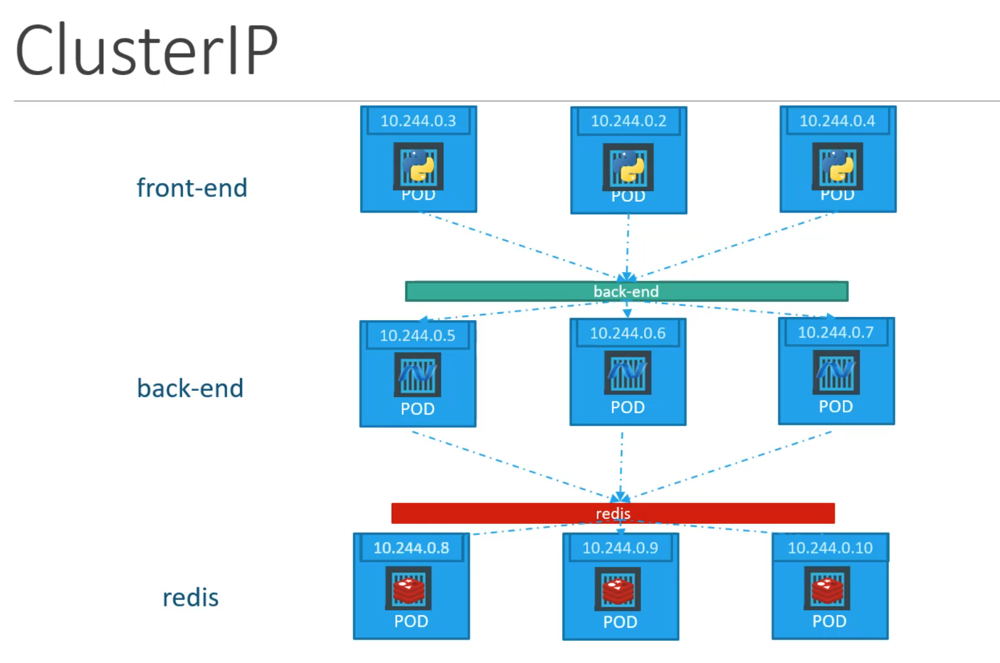
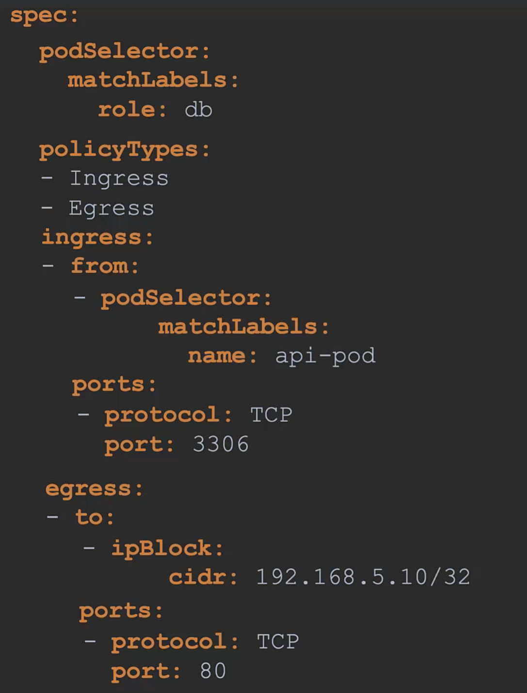
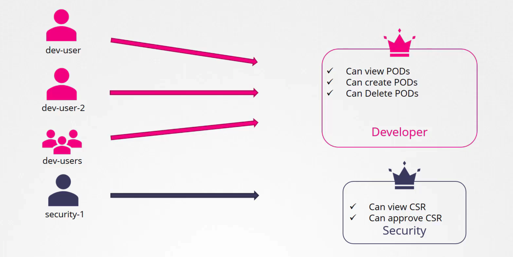

<div align="center">
  <h1>Kubernetes Certified Application Developer (CKAD) </h1>
</div>

<h1>Table of Contents</h1>

- [Course](#course)
- [Notes](#notes)
- [Certifications](#certifications)
- [Handbook](#handbook)
  - [Core Concepts](#core-concepts)
    - [Recap - Kubernetes Architecture](#recap---kubernetes-architecture)
    - [`Docker` vs `ContainerD`](#docker-vs-containerd)
    - [Recap - Pods](#recap---pods)
    - [Recaps - Pods with YAML](#recaps---pods-with-yaml)
    - [Practice Test \& Solution - Pods](#practice-test--solution---pods)
    - [Edit Pods (for practial quizzes)](#edit-pods-for-practial-quizzes)
    - [Recap - ReplicaSets, Controllers](#recap---replicasets-controllers)
    - [Practice Test \& Solution - ReplicaSets](#practice-test--solution---replicasets)
    - [Recap: Deployments](#recap-deployments)
    - [Certification Tip: Formatting Output with kubectl](#certification-tip-formatting-output-with-kubectl)
    - [Recap: Namespaces](#recap-namespaces)
    - [Practice Test \& Solution - Namespace](#practice-test--solution---namespace)
    - [Certification Tip: Imperative commands](#certification-tip-imperative-commands)
    - [Practice Test \& Solution - Imperative Commands](#practice-test--solution---imperative-commands)
  - [Configuration](#configuration)
    - [Define, build, and modify contianer images](#define-build-and-modify-contianer-images)
    - [Practice Test \& Solution: Docker Images](#practice-test--solution-docker-images)
    - [Commands and Arguments in Doccker](#commands-and-arguments-in-doccker)
    - [Commands and Arguments in Kubernetes](#commands-and-arguments-in-kubernetes)
    - [Practice Test \& Solution: Commands and Arguments](#practice-test--solution-commands-and-arguments)
    - [Environment Variables](#environment-variables)
    - [ConfigMaps](#configmaps)
    - [Practice Test \& Solution: ConfigMaps](#practice-test--solution-configmaps)
    - [Kubernetes Secrets](#kubernetes-secrets)
    - [Secret Store CSI Driver](#secret-store-csi-driver)
    - [Practice Test \& Solution: Secrets](#practice-test--solution-secrets)
    - [Demo: Encrypting Secret Data at Rest](#demo-encrypting-secret-data-at-rest)
    - [Docker Security](#docker-security)
    - [Security Contexts](#security-contexts)
    - [Practice Test - Security Contexts](#practice-test---security-contexts)
    - [Service Accounts](#service-accounts)
    - [Practice - Service Accounts](#practice---service-accounts)
    - [Resource Requirements](#resource-requirements)
    - [Practice Test - Resource Requirements](#practice-test---resource-requirements)
    - [Taints and Tolerations](#taints-and-tolerations)
    - [Practice Test - Taints and Toleration](#practice-test---taints-and-toleration)
    - [Node Selectors](#node-selectors)
    - [Node Affinity](#node-affinity)
    - [Liveness Probes](#liveness-probes)
    - [Container Logging](#container-logging)
    - [Monitor and Debug Applications](#monitor-and-debug-applications)
  - [POD Design](#pod-design)
    - [Labels, Selectors and Annotations](#labels-selectors-and-annotations)
    - [Rolling Updates \& Rollbacks in Deployments](#rolling-updates--rollbacks-in-deployments)
    - [Updating deployment](#updating-deployment)
    - [Demo: Deployment](#demo-deployment)
    - [Deployment strategy - Blue Green](#deployment-strategy---blue-green)
    - [Deployment strategy - Canary](#deployment-strategy---canary)
    - [Jobs](#jobs)
    - [CronJobs](#cronjobs)
  - [Services and Networking](#services-and-networking)
    - [Services](#services)
    - [Services - Cluster IP](#services---cluster-ip)
    - [Ingress Networking](#ingress-networking)
    - [What is rewrite-target option?](#what-is-rewrite-target-option)
    - [Network Policies](#network-policies)
    - [Developing Network Policies](#developing-network-policies)
  - [State Persistence](#state-persistence)
    - [Volumes](#volumes)
    - [Persistent Volumes](#persistent-volumes)
    - [Persistent Volume Claims](#persistent-volume-claims)
    - [Practice Test - Persistent Volumes](#practice-test---persistent-volumes)
    - [Note on Optional Topics](#note-on-optional-topics)
    - [Storage Classes](#storage-classes)
    - [Practice Test - Storage Class](#practice-test---storage-class)
    - [Why Stateful Sets ?](#why-stateful-sets-)
    - [Stateful Sets Introduction](#stateful-sets-introduction)
    - [Headless Services](#headless-services)
    - [Storage in StatefulSets](#storage-in-statefulsets)
  - [Security](#security)
    - [Authentication, Authorization, and Admission Control](#authentication-authorization-and-admission-control)
    - [Authentication](#authentication)
    - [Setting up Basic Authentication](#setting-up-basic-authentication)
    - [KubeConfig](#kubeconfig)
    - [Practice Test \& Solution - KubeConfig](#practice-test--solution---kubeconfig)
    - [API Groups](#api-groups)
    - [Authorization](#authorization)
    - [Role Based Access Controls](#role-based-access-controls)
    - [Practice Test \& Solution - Role Base Access Controls](#practice-test--solution---role-base-access-controls)
    - [Cluster Roles](#cluster-roles)
    - [Practice Test \& Solution - Cluster Roles](#practice-test--solution---cluster-roles)
    - [Admission Controllers](#admission-controllers)
    - [Labs \& Solution - Admission Controllers](#labs--solution---admission-controllers)
    - [Validating and Mutating Admission Controllers](#validating-and-mutating-admission-controllers)
    - [Labs \& Solution - Validating and Mutating Admission Controllers](#labs--solution---validating-and-mutating-admission-controllers)
    - [API Versions](#api-versions)
    - [API Deprecations](#api-deprecations)
    - [Lab \& Solution - API Versions/Deprecations](#lab--solution---api-versionsdeprecations)
    - [Custom Resource Definition](#custom-resource-definition)
    - [Practice Test - Custom Resource Definition](#practice-test---custom-resource-definition)
    - [Custom Controllers](#custom-controllers)
    - [Operator Framework](#operator-framework)
  - [Helm Fundamentals](#helm-fundamentals)
    - [Helm Introduction](#helm-introduction)
    - [Install Helm](#install-helm)
    - [Labs \& Solution - Install Helm](#labs--solution---install-helm)
    - [Helm Concepts](#helm-concepts)
    - [Labs \& Solution - Helm Concepts](#labs--solution---helm-concepts)


# Course 
https://www.udemy.com/course/certified-kubernetes-application-developer/

# Notes
Definition files here might have been changed since this is written, always refer to the source of truth in k8s docs: (use this as point of reference)
https://kubernetes.io/docs/home/

# Certifications

- CKAD: https://www.cncf.io/training/certification/ckad/
- Candidate Handbook: https://docs.linuxfoundation.org/tc-docs/certification/lf-handbook2
- Exam Tips: https://docs.linuxfoundation.org/tc-docs/certification/tips-cka-and-ckad

# Handbook

## Core Concepts

### Recap - Kubernetes Architecture

- Nodes(Minions): physical or virtual machine in which kubernetes is installed 
- To maintain availability, we need multiple nodes. 
- Cluster: group of nodes
- Master: another node with kube installed in it, watch over nodes in their cluster, responsible for orchestration of containers on the worker nodes
- Components: things that you get when installing kubernetes
  - API server: users interact with API server to interact with kube cluster
  - etcd: key-value store. Stores information between masters and worker nodes in a distributed manner. Implmeenting locks in a cluster to make sure no conflicts between masters
  - kubelet: agent that runs on each node on each cluster. Make sure that container running in the nodes as expected
  - Container Runtime: underlying software that used to run containers (docker, containerd)
  - Controller: responsible for noticing and responding when container or endpoints goes doewn. It will create new containers if it notice
  - Scheduler: distributing works or containers accross multiple nodes
- Master vs Worker nodes
  - Worker Node (minion): has kubelet and where containers are hosted
  - Master: has kube-apiserver, etcd, controller, scheduler
- `kubectl`
  - used to deploy and manage application on k8s cluster
  - Some basics:
    - `kubectl run <service>`: to run an application on the cluster
    - `kubectl cluster-info`: get information of the cluster
    - `kubectl get nodes`: get nodes of the cluster

### `Docker` vs `ContainerD`

- Container Runtime Interface (CRI): originally kube only made for docker, as it grows popularity, it provides interface to allow other container runtime to be orchestrate by kubernetes as long as they adhere to OCI standards. What is OCI>
- Open Container Interface (OCI)
  - `imagespec`: define how an image should be built
  - `runtimespec`: standards on how any container runtime should be developed
- `dockershim`: temporary way of kubernetes to work with docker. Since docker doesn't use CRI (because CRI is created far after docker is created). It is removed in `v1.24`
- `containerd`: container runtime in docker is `runc`. And the daemon that maintain `runc` is called `containerd`. `containerd` is CRI compatible and is its own runtime separate from docker
  - github: https://github.com/containerd
  - docs: https://containerd.io/
  - `ctr`: containerd cli
    - limited set of features
    - not user friendly
    - can do:
      - pull image
      - run container
  - `nerdctl`
    - provides docker like CLI for containerD, examples:
    ```
    nerdctl run --name redis redis:alpine
    nerdctl run --name webserver -p 80:80 -d nginx
    ```
    - supports docker compose
    - supports newest feature in containerd
      - encrypted container images
      - lazy pulling
      - p2p image distribution
      - image signing and verifying
      - namespaces in k8s
  - `crictl`: 
    - CLI for any CRI compatible container runtimes
    - Installed separately
    - Used to inspect and debug container runtimes
      - Not to create containers ideally
    - Works across different runtimes
    - Used for debuggin purposes
    - docker like cli, but aware of pods
    - Examples:
        ```bash
        crictl pull busybox
        crictl images
        crictl ps -a
        crictl logs <container-id>
        crictl pods # unlike docker, aware of pods
        ```

### Recap - Pods
- Assumptions:
  - the applications already published to docker hub, image can be pulled by k8s
  - we have a running k8s cluster, and is working. All services are in running state
- K8s doesn't assign container directly in worker nodes, instead the containers is encapsulated in k8s objects known as pods. 
- Pod is a single instance of an application. is the smallest object you can create in k8s
- Hierarchy: Kubernetes cluster -> Node -> Pod -> Container
- Scaling up application, meaning to increase the number of pods 
- A pod can contain multiple containers. But not the container of the same kind (helper containers + main container)
- The idea of pod is to contain multiple containers that is part of the same app, so that operation such as creation, removal, load balance, network space can be much easily done.
- `kubectl`
  ```bash
  kubectl run nginx --image nginx # deploys a docker container by creating a pod. Image is pulled from docker hub
  kubectl get pods
  ```

### Recaps - Pods with YAML
- YAML in Kubernetes
```yaml
# pod-definition.yml

apiVersion: v1 #available values: v1, apps/v1
kind: Pod # available values: Pod, Service, ReplicaSet, Deployment
metadata: 
  name: myapp-pod
  labels: # can fit anything key-value pair inside labels field as you see fit
    app: myapp
    type: front-end
spec:
  containers:
    - name: nginx-container # with `-` define list of items
      image: nginx
```
- To create: `kubectl create -f pod-definition.yml`
- To view: `kubectl get pods`
- To inspect pod: `kubectl describe pod myapp-pod`

### Practice Test & Solution - Pods
- Practice: https://kodekloud.com/topic/pods-4
- Solution: [practice1_pods](./practices/practice1_pods)

### Edit Pods (for practial quizzes)
- to edit an existing POD:
  - if given a pod definition file, edit that file and use it to create new pod
  - if not given pod defnition file, extract the definition to a file using command:
  ```bash
  kubectl get pod <pod-name> -o yaml > pod-definition.yaml
  ```
  - To modify the properties of the pod, can utilize the:
  ```bash
  kubectl edit pod <pod-name>
  ```
    - Editable properties (official doc as source of truth: https://kubernetes.io/docs/reference/kubectl/generated/kubectl_edit/)
      - spec.containers[*].image
      - spec.initContainers[*].image
      - spec.activeDeadlineSeconds
      - spec.tolerations
      - spec.terminationGracePeriodSeconds

### Recap - ReplicaSets, Controllers
-  Recap Controllers: brain behind kubernetes
  - processes that monitor kubernetes objects and respond accordingly
- Replication controller: one type of the controller, ensures high availibility by allowing run multiple instances of a single pod in a cluster. 
  - If there is a single pod, replication controller helps by creating new pod if that existing one fails
  - Also help in load balancing & scaling as user demand increases. Replication controller can spans accross multiple nodes in a single cluster
  - Two similar terms: Replication Controller (older) and Replica Set (newer). Minor differences in the way it works, but main concept still same
  - Creating Replication Controller:
    - Define yml file
      ```yaml
      apiVersion: v1
      kind: ReplicationController
      metadata:
        name: myapp-rc
        labels: 
          app: myapp
          type: frontend
        spec:
          template: #should be what our pod definiton be, similar to previous exercies (`pod-definition.yaml`)
            metadata: 
              name: myapp-pod
              labels: 
                app: myapp
                type: front-end
            spec:
              containers:
                - name: nginx-container 
                  image: nginx
            replicas: 3
      ```
    - Create from yml file
    ```bash
    kubectl create -f rc-definition.yml
    ```
    - Get replicationcontroller information
    ```bash
    kubectl get replicationcontroller
    kubectl get pods
    ```
  - Now, Creating ReplicaSet (newer):
    - Major difference: `selector` field. 
      - This allows ReplicaSet to manage pods that were not created as part of the replicaset creation.
      - For example: pods created before or after the replicaset creation that matches `matchLabels` can be managed by ReplicaSet
    - Define yml file
      ```yaml
      apiVersion: apps/v1
      kind: ReplicaSet
      metadata:
        name: myapp-replicaset
        labels: 
          app: myapp
          type: frontend
      spec:
        template: #should be what our pod definiton be, similar to previous exercies (`pod-definition.yaml`)
          metadata: 
            name: myapp-pod
            labels: 
              app: myapp
              type: front-end
          spec:
            containers:
              - name: nginx-container 
                image: nginx
        replicas: 3
        selector: 
          matchLabels:
            type: front-end
      ```
    - Create replicaset
    ```bash
    kubectl create -f replicaset-definition.yml
    ```
    - get information
    ```bash
    kubectl get replicaset
    kubectl get pods
    ```
  - Labels and Selectors:
    - filters out pods for replicaset to monitor and manage
  - Scale
    - How to change number of replicas of our  replicaset. 
      1. Change `replicas` field in the `yml` file and:
      ```bash
      kubectl replace -f replicaset-definition.yml
      ```
      2. use `scale` command
      ```bash
      kubectl scale --replicas=6 -f replicaset-definition.yml 
      # or
      kubectl scale --replicas=6 replicaset myapp-replicaset # replicaset: TYPE | myapp-replicaset: NAME
      ```
  - Commands Summary:
    - `create`
    - `get`
    - `delete`
    - `replace`
    - `scale`

### Practice Test & Solution - ReplicaSets
- Practice: https://uklabs.kodekloud.com/topic/replicasets-2/
- Solution: [practice2_replicasets](./practices/practice2_replicasets/)

### Recap: Deployments
- From `ReplicaSet`, we understand this hierarchy flow: ReplicaSet -> Pods -> Container
- `Deployment` stands here in the hierarchy: Deployment -> ReplicaSet -> Pods -> Container
- It is a kubernetes object that provides ability to upgrade the underlying instance seamlessly, allow to
  - Rolling updates
  - Rollback deployment
  - Pause changes
  - Resume changes
- To create
  - Definition file
      ```yaml
      apiVersion: apps/v1
      kind: Deployment
      metadata:
        name: myapp-deployment
        labels: 
          app: myapp
          type: frontend
      spec:
        template: #should be what our pod definiton be, similar to previous exercies (`pod-definition.yaml`)
          metadata: 
            name: myapp-pod
            labels: 
              app: myapp
              type: front-end
          spec:
            containers:
              - name: nginx-container 
                image: nginx
        replicas: 3
        selector: 
          matchLabels:
            type: front-end
      ```
    - create from file
      ```bash
      kubectl create -f deployment-definiton.yml
      ```
    - get info
      ```
      kubectl get all # Get ALL objects created
      kubectl get deployments # get all deployments
      kubectl get replicaset
      kubectl get pods
      ```

### Certification Tip: Formatting Output with kubectl
- Default output format for all **kubectl** commands is human readable plain text format
- We can leverage the `-o` flag to output the details in several different formats
- `kubectl [command] [TYPE] [NAME] -o <output_format>`, some commonly used:
  - -o json: Output a JSON formatted API object.
  - -o name: Print only the resource name and nothing else.
  - -o wide: Output in the plain-text format with any additional information.
  - -o yaml: Output a YAML formatted API object.
- Helpful links
  - https://kubernetes.io/docs/reference/kubectl/
  - https://kubernetes.io/docs/reference/kubectl/quick-reference/
  - https://kubernetes.io/docs/reference/kubectl/jsonpath/

### Recap: Namespaces
- 
- House analogy: each namespace is a house, within each house they call each other by the first name, by call people from other house by their full name. 
- By default startup, kubernetes creates 3 namespace
  - `Default`: this is where all your objects by default will be created
  - `kube-system`: internal services such as networking solution, dns service etc
  - `kube-public`: resources that should be made available for users are created
- Namespace is used for: 
  - Isolation
    - for example: you want to use same cluster for `dev` and `prod` but want to isolate the resources for each env. Can create `dev` and `prod` namespaces
  - Policies: define who can do what
  - Resource Limits: limit resource for each namespace (cpu, memory, i/o, etc)
  - DNS: resources within a namespace can refer to each other simply by their names 
    - e.g. From your own namespace: `mysql.connect("db-service")`
    - e.g. From other namespace (default to dev): `mysql.connect("db-service.dev.svc.cluster.local")`
    - Format of the DNS name: `db-service.dev.svc.cluster.local`
      - db-service: service name
      - dev: namespace
      - svc: stands for `service`. default subdomain
      - cluster.local: default domain
  - To get by namespace
  ```bash
  kubectl get pods # by default, use default
  kubectl get pods --namespace=kube-system # other namespace use namespace option
  ```
  - Create namespace
    - namespace definiton file
    ```yaml
    apiVersion: v1
    kind: Namespace
    metadata:
      name: dev
    ```
    - create namespace
    ```bash
    kubectl create -f namespace-dev.yml # from file
    kubectl create namespace dev # directly
    ```
  - Switch default namespace
  ```bash
  kubectl config set-context $(kubectl config current-context) --namespace=dev # this command set-context to one(current-contex) then we set the namespace field to dev
  kubectl get pods
  ```
  - **Note**: will discuss context later
  - View pods in all namespaces
  ```bash
  kubectl get pods --all-namespaces
  ```
  - To limit resource usage within namespace, create `Resource Quota`
  ```yaml
  apiVersion: v1
  kind: ResourceQuota
  metadata:
    name: compute-quota
    namespace: dev
  spec:
    hard:
      pods: "10"
      requests.cpu: "4"
      requests.memory: 5Gi
      limits.cpu: "10"
      limits.memory: 10Gi
  ```
  ```bash
  kubectl create -f compute-quota.yaml
  ```

### Practice Test & Solution - Namespace
- Practice: https://uklabs.kodekloud.com/topic/namespaces-3/
- Solution: [practice3_namespace](./practices/practice3_namespace/)

### Certification Tip: Imperative commands
- Declarative(using defitnion file) or Imperative(directly)
- We rarely want to use Imperative, but it is useful to getting one-time tasks done quickly. 
- Two options that can come in handy:
  - `--dry-run`: By default, as soon as the command is run, the resource will be created. If you simply want to test your command, use the `--dry-run=client `option. This will not create the resource. Instead, tell you whether the resource can be created and if your command is right.
  - `-o yaml`: This will output the resource definition in YAML format on the screen.
- Use the above two in combination along with Linux output redirection to generate a resource definition file quickly, that you can then modify and create resources as required, instead of creating the files from scratch.
  - `kubectl run nginx --image=nginx --dry-run=client -o yaml > nginx-pod.yaml`
- Example: POD
  - create an NGINX Pod: `kubectl run nginx --image=nginx`
  - generate POD manifest YAML file (-o yaml): `kubectl run nginx --image=nginx --dry-run=client -o yaml`
- Example: Service
  - Create a `Service` named redis-service of type ClusterIP to expose pod redis on port 6379
  ```bash
  kubectl expose pod redis --port=6379 --name redis-service --dry-run=client -o yaml # this will use pod's label as selectors

  kubectl create service clusterip redis --tcp=6379:6379 --dry-run=client -o yaml # this will assuem selectors as app=redis. 

  # you cannot pass selector as option: https://github.com/kubernetes/kubernetes/issues/46191
  ```
  - Create a Service named nginx of type NodePort to expose pod nginx's port 80 on port 30080 on the nodes
  ```bash
  kubectl expose pod nginx --port=80 --name nginx-service --type=NodePort --dry-run=client -o yaml # with this can't specify the node port, have to manually add (but preferred than using create dry run)

  kubectl create service nodeport nginx --tcp=80:80 --node-port=30080 --dry-run=client -o yaml # this will not use pods label as selectors
  ```
- Reference: https://kubernetes.io/docs/reference/kubectl/conventions/ 

### Practice Test & Solution - Imperative Commands
- Practice: https://kodekloud.com/topic/imperative-commands/
- Solution: [practice4_imperative_commands](./practices/practice4_imperative_commands/)

## Configuration

### Define, build, and modify contianer images
- Why need to build our own:
  - if there is no existing image in registry that fulfils your service needs
  - ease of shipping and deployment
- To create an image
  - create `Dockerfile`: for [reference](https://docs.docker.com/reference/dockerfile/)
  - docker build: `docker build Dockerfile -t <account-name/image-name>`
    - failure: upon failure, docker will cache previous successful step, and will continue directly from last failed step
  - docker push: `docker push <acount-name/image-name>`
  - *Note*:
    - use `docker history <account-name/image-name>` after buld to see the detail of each step in Dockerfile process (e.g. how much storage they use)

### Practice Test & Solution: Docker Images
- Practice: https://uklabs.kodekloud.com/topic/practice-test-docker-images-2/
- Solution: [practice5_images](./practices/practice5_images/)

### Commands and Arguments in Doccker
- Note: a container only lives as long as the process is alive. Meaning if process stop, containers exited. What is the process that allow the container to live? Answer: the `CMD` or `ENTRYPOINT` inside the dockerfile (e.g. `CMD ["bash"]` meaning the container alive as long as the bash process is running)
- How to specify different command to start the container: append command to `docker run` command (e.g. `docker run ubuntu sleep 5` override the bash, making the container to sleep for 5 seconds then exits)
- How to make this change (`sleep 5`) permanent?
  - make a Dockerfile
  ```yaml
  FROM Ubuntu
  CMD sleep 5
  ```
  - can also use json array format (separate command and argument)
    ```yaml
    FROM Ubuntu
    CMD ["sleep", "5"]
    ```
  - build: `docker build -t ubuntu-sleeper`
  - run: `docker run ubuntu-sleeper`
- Pass in argument (e.g. sleep for x argument seconds). use `ENTRYPOINT` instead of `CMD`
```yaml
FROM Ubuntu
ENTRYPOINT ["sleep"]
```
- Default value (if no `x` argument passed when `docker run ubuntu-sleeper x`, will return error). combine `ENTRYPOINT` and `CMD`
```yaml
FROM Ubuntu
ENTRYPOINT ["sleep"]
CMD ["5"]
```
- Change base command to run (e.g. `sleep` to `sleep2.0`)
  - run: `docker run --entrypoint sleep2.0 ubuntu-sleeper 10`

### Commands and Arguments in Kubernetes
- create pod from `ubuntu-sleeper` from previous section
  - create `pod-definition.yml`
  ```yaml
  apiVersion: v1
  kind: Pod
  metadata:
    name: ubuntu-sleeper-pod
  spec:
    containers:
      - name: ubuntu-sleeper
        image: ubuntu-sleeper
        command: ["sleep2.0"] #override the ENTRYPOINT ["sleep"]
        args: ["10"] # override the CMD ["5"]
  ```
  - create pod
  ```bash
  kubectl create -f pod-definition.yml
  ```

### Practice Test & Solution: Commands and Arguments
- Practice: https://uklabs.kodekloud.com/topic/commands-and-arguments/
- Solution: [practice6_command_argument](./practices/practice6_command_argument/)

### Environment Variables
- `env` property in `.yaml` file. `env` is an array that takes a key(`name`)-value pair
  ```yaml
  apiVersion: v1 
  kind: Pod 
  metadata:
    name: ubuntu-pod
  spec:
    containers:
    - name: ubuntu
      image: ubuntu
      env:
        - name: COLOR
          value: pink
  ```
- Other ways of setting in environment variables
  - ConfigMaps (upcoming lecture)
  ```yaml
  env:
    - name: COLOR
      valueFrom:
            configMapKeyRef:
  ```
  - Secrets (upcoming lecture)
  ```yaml
  env:
    - name: COLOR
      valueFrom:
            secretKeyRef:
  ```

### ConfigMaps
- Motivation: when we have many pod definition files, can be hard to manage the environment variables
- ConfigMaps: pass configuration data in form of key-value pair to created pod
- 2 Phases:
  - Create ConfigMap
    - Imperative way:
    ```bash
      # literal format: <config-name> --from-literal=<key>=<value> 
      kubectl create configmap \
        app-config --from-literal=APP_COLOR=blue
        app-config --from-literal=APP_MOD=prod
      
      # from file format: <config-name> --from-file=<path-to-file>
      kubectl create configmap
        app-config --from-file=app_config.properties
    ```
    - Declarative way:
      - `config-map.yaml`
      ```yaml
      apiVersion: v1
      kind: ConfigMap
      metadata:
        name: app-config
      data:
        APP_COLOR: blue
        APP_MOD: prod
      ```
  - Inject them into pod
    - pod-definition.yaml (for all key-value pair of ConfigMap):  use `envFrom` -> `configMapRef` -> `name`. Where the `name` is the `name` metadata from ConfigMap definition
      ```yaml
      apiVersion: v1 
      kind: Pod 
      metadata:
        name: ubuntu-pod
      spec:
        containers:
        - name: ubuntu
          image: ubuntu
          envFrom:
            - configMapRef:
                name: app-config
      ```
    - pod-definition.yaml (for a single key-value pair of ConfigMap): use `env` property
      ```yaml
      apiVersion: v1 
      kind: Pod 
      metadata:
        name: ubuntu-pod
      spec:
        containers:
        - name: ubuntu
          image: ubuntu
          env:
            - configMapRef:
                name: app-config
                key: APP_COLOR
      ```
    - for volumes
      ```yaml
      volumes:
        - name: app-config-volume
          configMap:
            name: app-config
      ```
    - config-map.yaml
      ```yaml
      apiVersion: v1
      kind: ConfigMap
      metadata:
        name: app-config
      data:
        APP_COLOR: blue
        APP_MOD: prod
      ```
- View ConfigMaps:
  - `kubectl get configmaps`
  - `kubectl describe configmaps`

### Practice Test & Solution: ConfigMaps
- Practice: https://uklabs.kodekloud.com/topic/configmaps-2/
- Solution: [practice7_config_maps](./practices/practice7_config_maps/)

### Kubernetes Secrets
- Motivation: ConfigMap stored key-value pair in plain text data (not okay to store sensitive information like password and keys)
- Secret: similar to ConfigMap but used to store sensitive data
- 2 Phase:
  - Create Secret
    - Imperative way:
      - Secret file(for `fromfile`):
      ```
      DB_HOST: mysql
      DB_User: root
      DB_Password: password
      ```
      ```bash
      # literal format: <secret-name> --from-literal=<key>=<value>
      kubectl create secret generic\
        app-secret --from-literal=DB_HOST=mysql
        app-secret --from-literal=DB_Password=passwrod

      # from file format: <secret-name> --from-file=<path-to-file>
      kubectl create secret generic\
        app-secret --from-file=app_secret.properties
      ```
    - Declarative way:
      - secret-data.yaml
      ```yaml
      apiVersion: v1
      kind: Secret
      metadata:
        name: app-secret
      data:
        DB_Host: bXlzcWw=
        DB_User: cm9vdA==
        DB_Password: cGFzc3dvcmQ=
      ```
      - we encode the value before storing it
      ```bash
      echo -n mysql | base64 #output: bXlzcWw=
      ```
      - to decode back
      ```bash
      echo -n bXlzcWw= | base64 --decode
      ```
  - Inject to Pod
    - pod-definition.yaml (injecting all key-value pair)
      ```yaml
      apiVersion: v1 
      kind: Pod 
      metadata:
        name: ubuntu-pod
      spec:
        containers:
        - name: ubuntu
          image: ubuntu
          envFrom:
            - secretRef:
                name: app-secret
      ```
    - single env: use `env` property
    ```yaml
    env:
      - name: DB_Password
        valueFrom:
          secretKeyRef:
            name: app-secret
            key: DB_Password
    ```
    - Volume: the secret will be created as files with value of secrets as its content
      - e.g. `ls /opt/app-secret-volumes` -> DB_Host, DB_Password, DB_User
      - where each file contains the value of the key
    ```yaml
    volumes:
      - name: app-secret-volume
        secret:
          secretName: app-secret
    ```
    - secret-data.yaml
    ```yaml
    apiVersion: v1
    kind: Secret
    metadata: 
      name: app-secret
    data: 
      DB_Host: bXlzcWw=
      DB_User: cm9vdA==
      DB_Password: cGFzc3dvcmQ=
    ```
    - create the secret
    ```bash
    kubectl create -f pod-definition.yaml
    ```
- View Secrets:
  - `kubectl get secrets`
  - `kubectl describe secrets`
  - To view the valueL `kubectl get secret app-secret -o yaml`
- Note on Secrets:
  - Secrets only encoded. Not encrypted
    - Do not check-in Secret objects to SCM along with the code
  - Secrets are not encrypted in ETCD
    - Suggestted to encrypt secret at Rest
  - Anyone able to create pods/deployments in the same namespace can access the secrets
  - Consider third party secrets store providers (AWS ,Azure, GCP, Vault Provider)
- Additional Notes: https://www.udemy.com/course/certified-kubernetes-application-developer/learn/lecture/14827458#content
  
### Secret Store CSI Driver
https://www.youtube.com/watch?v=MTnQW9MxnRI

### Practice Test & Solution: Secrets
- Practice: https://uklabs.kodekloud.com/topic/secrets-4/
- Solution: [practice8_secrets](./practices/practice8_secrets/)

### Demo: Encrypting Secret Data at Rest
- Resource: https://kubernetes.io/docs/tasks/administer-cluster/encrypt-data/

### Docker Security
- Container and host share the same kernel. Container use namespace, each containers has it's own namespace, and each container can only see processes of its own namespace. But the host (also its own namespace), but since all containers run inside host's namespace, technically from host perspective, it can see all the processes run by each container it host (different PID from the container's PID). This is process isolation.
- User Isolation: by default, docker run process in container as root user (can check using `ps aux`) To run process to not run as root can use option `--user`
  ```bash
  docker run --user=1000 ubuntu sleep 3600
  ```
  - or user can be defined in the image
    - e.g. Dockerfile
      ```Dockerfile
      FROM UBUNTU
      USER 1000
      ```
    - build image: `docker build -t my-ubuntu-imag .`
    - run container using image: `docker run my-ubuntu-image sleep 3600`
  - But docker uses Linux Capabilities: basically it limits the capability even for root user when it runs on container
    - can check in `/usr/include/linux/capability.h`
    - override privilege: `docker run --cap-add MAC_ADMIN ubuntu`
    - drop privileege: `docker run --cap-drop kill ubuntu`

### Security Contexts
- Similar to previous section on Docker security user isolation, we can do the same in k8s with security contexts
- In k8s, container is isolated within pods
  - if user isolation setting in the pod: applies to all containers
  - if both container and pod apply user isolation setting: setting in container override the pod's setting
- Pod level:
```yaml
apiVersion: v1
kind: Pod
metadata: 
  name: web-pod
spec:
  securityContext:
    runAsUser: 1000
  containers:
    - name: ubuntu
      image: ubuntu
      command: ["sleep", "3600"]
```
- Container level:
```yaml
apiVersion: v1
kind: Pod
metadata: 
  name: web-pod
spec:
  containers:
    - name: ubuntu
      image: ubuntu
      command: ["sleep", "3600"]
      securityContext:
        runAsUser: 1000
        capabilities: # capabilities only supported in container level and not pod level
          add: ["MAC_ADMIN"]
```

### Practice Test - Security Contexts
- Practice: https://uklabs.kodekloud.com/topic/security-contexts-3/ 
- Solution: [practice9_security_contexts](./practices/practice9_security_contexts/)

### Service Accounts
- Linked with other security related concepts such as auth, RBAC, etc
- But, for CKAD course, we need to only know how to use Service Accounts
- 2 Types of Accounts
  - User Account (Human)
    - e.g. Admin accessing cluster to perform some task or dev accessing cluster to deploy application
  - **Service Account** (Machine)
    - e.g. Monitoring application like prometheus use service account to poll k8s API
- To create a Service Account
  - Imperative:
    ```bash
    kubectl create serviceaccount dashboard-sa
    kubectl get serviceaccount # by default, each namespace has its own `default` service account
    kubectl describe serviceaccount dashboard-sa # has Tokens property, stored as a secret object (e.g. dashboard-sa-token-kbbdm)

    kubectl describe secret dashboard-sa-token-kbbdm # accessing the token in the `token` field
    ```
  - Default service acocunt
    - By default, each namespace has its own `default` service account
    - When you create a new pod (without servie account config), it will automatically mount the `default` service account in the `Volumes` directive (e.g. `default-token-j4hkv`)
    - The `default` service account capability is very limited
    ```bash
    kubectl describe pod my-kubernetes-dashboard #check the Volumes and Mounts section
    kubectl exec -it my-kubernetes-dashboard --ls /var/run/secrets/kubernetes.io/serviceaccount # where the service account is stored
    kubectl exec -it my-kubernetes-dashboard cat /var/run/secrets/kubernetes.io/serviceaccount/token # see the token
    ```
  - Disable of using default service account
  ```yaml
  apiVersion: v1
  kind: Pod
  ...
  spec:
    ...
    automountServiceAccountToken: false # HERE
  ```
  - Use custom service account in pod definiton (need to delete and recreate the pod to take effect)
  ```yaml
  apiVersion: v1
  kind: Pod
  ...
  spec:
    ...
    serviceAccountName: dashboard-sa # HERE
  ```
  - but for deployment, will take care of deleting and recreating with new service account.
  - K8s 1.22/1.24 changes
    - if you go to https://jwt.io/, and paste in the serviceAccount token stored in each pod (e.g. /var/run/secrets/kubernetes.io/serviceaccount/token), notice that the token don't have expiry date
    - `v1.22` Introduced TokenRequestAPI: provisioning k8s serviceAccount token, more secure and scalable
      - Pod not use serviceAccount tokens by default anymore, instead it mounts a projected volume, that communicates and updates the auth token using the TokenRequestAPI
    - `v1.24` Reduction of secret-based serviceAccount tokens
      - when creating a service account, it don't automatically create secret for you
      - for example, to do simulate behavior in the beginning of section (create token, but not secret object that contains token inside)
      ```bash
      kubectl create serviceaccount dashboard-sa
      kubectl create token dashboard-sa # if we copy and decode it in jwt.io, now there is expiry date 
      ``` 
      - To create alongside with secret object that contains token inside (`secret-definition.yml`)
      ```yaml
      apiVersion: v1
      kind: Secret
      type: kubernetes.io/service-account-token
      metadata:
        name: mysecretname
        annotations:
          kubernetes.io/service-account-name: dashboard-sa # have this service-account first
      ```
      - But doing these is not recommended anymore (should only create a service account token if TokenRequestAPI can't be used)

### Practice - Service Accounts
- Practice: https://uklabs.kodekloud.com/topic/service-account-2/
- Solution: [practice10_service_accounts](./practices/practice10_service_accounts/)

### Resource Requirements
- Every pod require a set of resources to run, whenever a pod is place on a node, it consumes the resource from that node
- kube-scheduler decides which node a pod goes to, if no resource availaable in any of the nodes, scheuler will hold on placing node, and pod status will be failed due to "Insufficent cpu" or other resources
- **Request**: To specifiy resource requirement for each pod (Resource Requests)
  - To specify:
  ```yaml
  apiVersion: v1
  kind: Pod
  spec:
    ...
    containers:
    - name: webapp
      ...
      resources:
        requests:
          memory: "4Gi"
          cpu: 2
  ```
  - What does 1 CPU mean?
    - first, it is equivalent to
      - 1 AWS vCPU
      - 1 GCP core
      - 1 Azure Core
      - 1 Hyperthread
    - Lowest it can go is "1M" or 0.001
  - With memory, the unit goes
    - 1 G(Gigabyte) -> 1 M(Megabyte) -> 1 K(Kilobyte) or
    - 1 Gi(Gibibyte)(or equivalent to 1.073741 G) -> 1 Mi -> 1 Ki
- **Limit**: By default a container has no limit on the resources it consumes (meaning given enough time it might consumes the resource of the whole node), so crucial to set limit
  - To specify limit
  ```yaml
  apiVersion: v1
  kind: Pod
  spec:
    ...
    containers:
    - name: webapp
      ...
      resources:
        requests:
          memory: "4Gi"
          cpu: 1
        limits:
          memory: "4Gi"
          cpu: 2
  ```
  - What happened when a pod want to exceed it limits?
    - CPU: not allowed, will be throttled at its limit
    - Memory: a container can go over its defined limit, and pod will be terminated caused of OOM(Out of Memory) error
  - Default Behavior
    - K8s doesn't have request and limit
    - any pod can consume as many resource as they want
  - Behavior/ Cases
    - CPU: 
      - No request, have limits: request = limits
      - Have request, have limits: CPU between request - limits
      - Request, no limits: most ideal setup (case by case), but pod will always have resource guaranteed
    - Memory:
      - No request, have limits: request = limits
      - Have request, have limits
      - Request, no limits: any pod can consume as much memory, if a pod consumes memory too much memory the only way to retrieve it is to kill the pod itself
- `Limit Range`: define default values to containers in pod (define in **namespace** level) 
  - `limit-range-cpu.yaml` (same setup with memory, just use `memory` instead of `cpu`)
  ```yaml
  apiVersion: v1
  kind: LimitRange
  metadata:
    name: cpu-resource-constraint
  spec:
    limits:
    - default: #limit
        cpu: 500m
      defaultRequest: #request
        cpu: 500m
      max:
        cpu: "1"
      min:
        cpu: 100m
      type: Container
  ```
- `Resource Quotas`: restrict total amount of resources used by application deployed in a cluster (**namespace** level object)
  - `resource-quota.yaml`
  ```yaml
  apiVersion: v1
  kind: ResourceQuota
  metadata:
    name: my-resource-quota
  spec:
    hard:
      requests.cpu: 4
      requests.memory: 4Gi
      limits.cpu: 10
      limits.memory: 10Gi
  ```

### Practice Test - Resource Requirements
- Practice: https://uklabs.kodekloud.com/topic/resource-limits-2/
- Solution: [practice11_resource_requirements](./practices/practice11_resource_requirements/)

### Taints and Tolerations
- Analogy: bug, human, and bug spray
  - bug spray keeps bug away from human, in this case bugs are intolerant to bug spray.
  - but not all bugs, are intolerant to all bug spray. It all depends on the Intolerant level of the bug and the taint used, some bug can tolerate certain taint
  - in K8s:
    - human: `node`
    - bugs: `pod`
    - bug spray: `taint`
    - it has nothing to do with security, rather restriction on which pod can be scheduled on a node
- Default behavior: all nodes have no taint, and all pods have no toleration. Meaning if a node has a taint, no pod unless given a toleration to that taint is able to get scheduled in that node.
- Taint - Node
  - Create
  ```bash
  kubectl taint nodes node-name key=value:taint-effect # format
  kubectl taint nodes node1 app=blue:NoSchedule # give a taint of key app and value blue, wiht NoScheudle effect
  ```
    - 3 types of taint-effects
      - NoSchedule: pod will not schedule on the node 
      - PreferNoSchedule: pod will not preferable to be schedule on the node (but not guarantee)
      - NoExecute: new pods will not be scheduled on the node and existing pod on the node will be evicted if they don't tolerate to the taint
- Toleration - Pods
  - Create
  ```bash
  kubectl taint nodes node1 app= blue:NoSchedule
  ```
  - `pod-defintion.yaml` :all toleration field value must use dobule quote (`""`)
  ```yaml
  apiVersion: v1
  kind: Pod
  ...
  spec:
    ...
    tolerations:
      - key: "app"
        operator: "Equal"
        value: "blue"
        effect: "NoSchedule"
  ```
- Note: Taint does not ensure that a pod is assiged to that node, a pod with a toleration can be scheduled to any node event those nodes with no taint at all. If the goal is to ensure that a pod goes into certain nodes, we can achieve that using `Node Affinity` in the next section
- Note: master node, the node that is responsible for holding all the management software. Master node don't have any pods on it because when it created, a taint is put onto the master node that prevents any pod to be schedule in it
  - To see it: `kubectl describe node kubemaster | grep Taint`

### Practice Test - Taints and Toleration
- Practice: https://uklabs.kodekloud.com/topic/taints-and-tolerations-3/
- Solution: [practice12_taints_toleration](./practices/practice12_taints_toleration/)

### Node Selectors
- 3 nodes cluster with different specs (some large, some small)
- Let say for certain pod, it can only run on the large node due to the amount of resource it requires
- In default setup, any pods can go to any nodes
- We can set limitation on the pod, there are 2 ways to do this:
  - Node Selectors (`nodeSelector` field)
  ```yaml
  apiVersion:
  kind: Pod
  metadata:
    name: myapp-pod
  spec:
    containers:
    - name: data-processor
      image: data-processor
    nodeSelector:
      size: Large
  ```
  - How do k8s know which node has `size` -> `Large`?
  - This is just label, how to label the node?
  ```bash
  kubectl label nodes <node-name> <label-key>=<label-value>\
  kubectl label nodes node-1 size=Large
  ```
  - For more complex selections (e.g only large OR medium nodes, NO small nodes at all). To do this can use node affinity

### Node Affinity
- Do the complex selection such as `Or` operator, `In` operator [affinity](https://kubernetes.io/docs/concepts/scheduling-eviction/assign-pod-node/#affinity-and-anti-affinity)
- From our example in node affinity:
  ```yaml
  apiVersion:
  kind: Pod
  metadata:
    name: myapp-pod
  spec:
    containers:
    - name: data-processor
      image: data-processor
    nodeSelector:
      size: Large
  ```
- Will look like this (both do the same thing)
  ```yaml
  apiVersion:
  kind:
  metadata:
    name: myapp-pod
  spec:
    containers:
      - name: data-processor
        image: data-processor
    affinity:
      nodeAffinity:
        requiredDuringSchedulingIgnoreDuringExecution:
          nodeSelectorTerms:
            - matchExpressions:
              - key: size
                operator: In
                values: # multiple values like this mean OR (large or medium)
                  - Large
                  - Medium
              - key: size
                operator: NotIn # not small node
                values:
                  - Small
              - key: size
                operator: Exists # this if we just want to simply check if the node exist with size label
    ```
- Node Affinity Types 
  - Notice this 2 keywords: `DuringScheduling` and `DuringExecution`
  - Available Types (`IgnoredDuringExecution` meaning that if during node lifetime, someone let say remove the label. The pods will not be evicted)
    - `requiredDuringSchedulingIgnoredDuringExecution`(Type 1): use this one if pod placement on nodes very important, because if no node matched the labels, pods will not be scheduled
    - `preferredDuringSchedulingIgnoredDuringExecution` (Type 2): use this if running pods more important than the node placement itself (it will just try its best, but if not found, it will schedule to another node)
  - Planned Types: (`RequiredDuringExecution` meaning that if during node lifetime, someone let say remove the label. The pods will be evicted)
    - `requiredDuringSchedulingRequiredDuringExecution` (Type 3)
  

### Practice Test & Solution - Node Affinity
- Practice: https://uklabs.kodekloud.com/topic/node-affinity-3/
- Solution: [practice13_node_affinity](./practices/practice13_node_affinity/)

### Taints & Tolerations vs Node Affinity
- Taints & Toleration: Does not guarantee that a tolerated pod will be scheduled in a matching tainted node
- Node Affinity: Does not guarantee that the pods scheduled in the node will have matching labels

### Tips & Tricks
- https://www.linkedin.com/pulse/my-ckad-exam-experience-atharva-chauthaiwale/
- https://medium.com/@harioverhere/ckad-certified-kubernetes-application-developer-my-journey-3afb0901014
- https://github.com/lucassha/CKAD-resources

## Multi-Container Pods

### Multi-Container Pods
- [Article](https://amitsharma13318.medium.com/understanding-kubernetes-multi-container-pod-patterns-and-init-containers-35f6996e17a1)
- 3 Common Patterns
  - Sidecar: 
    - example: logging agent container sending logs from webserver container to central log server
  - Adapter:
    - example: generated log from different webserver containers is converted to a standardized format before sending to central log server
  - Ambassador:
    - example: generate containers as proxy to different databases depending on your environment (test, dev, staging, production)
  

### Practice Test & Solution - Multi-Container Pods
- Practice: https://uklabs.kodekloud.com/topic/multi-container-pods-3/
- Solution: [practice14_multi_container_pods](./practices/practice13_node_affinity/)

### Init Containers
- Udemy : https://www.udemy.com/course/certified-kubernetes-application-developer/learn/lecture/32568700#content
- Official guide of init container: https://kubernetes.io/docs/concepts/workloads/pods/init-containers/
- Basically, we can define sets of containers that will usually run a one time (initializing) process until completions, before deploying the normal containers

### Practice Test & Solution - InitContainers
- Practice: https://uklabs.kodekloud.com/topic/init-containers-3/
- Solution: [practice15_init_containers](./practices/practice15_init_containers/)

## Observability
### Readiness and Liveness Probes
- https://kubernetes.io/id/docs/tasks/configure-pod-container/configure-liveness-readiness-startup-probes/
- 2 terms we need to understand
  - POD status: where the pod is in its lifecycle (high level summary of a pod)
    - **Pending state**: pod not scheduled(waiting) to a node (can use `kubectl describe pod` to check the reason why)
    - **Container Creating state**: images required pulled and containers start
    - **Running state**: once containers start until it finihses its task or indefinitely
  - POD conditions: true or false key:value of a pod (`kubectl describe pod` in the condition section)
    - **PodScheduled**
    - **Initialized**
    - **ContainersReady** 
    - **Ready**: can be seen in `kubectl get pods` command too (e.g. READY 1/1)
- What is Ready?
  - For example a jenkin job can take 10 minutes to start, but at the time container is already running and pod is already marked ready
  - Default behavior: kubernetes assume that when a container started, it is "ready" to serve traffic, but this is not true
- Readiness Probe
  - conditions to fulfill in order for a pod to be marked "ready" (override default behavior "ready" when container started)
  - 
  - yaml file
  ```yaml
    ...
    spec:
      containers:
        - ...
          readinessProbe:
            httpGet:
              path: /api/ready
              port: 8080
  ```
  
### Liveness Probes
- Periodic test whether the application within the container is healthy, if test failed container is destroyed and restarted
- 
- Same as readiness probe configuration, but use `livenessProbe` field.
```yaml
    ...
    spec:
      containers:
        - ...
          livenessProbe:
            httpGet:
              path: /api/ready
              port: 8080
  ```

### Container Logging
- Logging in `docker`: use `-f` option for live stream of log
  - `docker logs -f <container-id>`
- Loggin in `k8s`
  - `kubectl logs -f <pod-name>` 
  - if there are multiple container within a pod, need to specify container name
    - `kubectl logs -f <pod-name> <container-name>`

### Monitor and Debug Applications
- monitoring metrics (container resource usage, disk util, pod resource usage, network traffic, etc)
- no k8s monitoring built in solution
- have some Metrics Server alternatives (e.g. prometheus, elastic stack, dyna trace)
- For CKAD, can focus on Metrics Server (other tools will be covered in CKA course):
- Metrics Server
  - 1 server per cluster
  - In memory (not on disk, thus not persistent)
  - Kubelet: contains sub-component called cAdvisor (container advisor). responsible for retrieving performance metrics from pods and exposing them to kubelet API to make them available from the metric server
- Getting started
```bash
  minikube addons enable metrics-server # if using minkube
  # other tools
  git clone https://github.com/kubernetes-incubator/metrics-serve 
  kubectl create -f deploy/1.8+/

  # to view
  kubectl top node
  kubectl top pod
```
- 

## POD Design
### Labels, Selectors and Annotations
- Labels and Selectors:
  - standard method to group things together
  - Labels: property attached to each items (e.g. color, class)
  - Selectors: selecting objects filter the labels (e.g. color = green & class = mammals)
  - To define labels:
  ```yaml
  ...
  metadata:
    ...
    labels:
      app: app1
      function: webserver
    ...
  ```
  - get label: `kubectl get pods --selector app=App1`
- Annotations:
  - record other details for informatory purpose
  - e.g buildversion, email, id, etc (for intergartion purposes)
  ```yaml
  ...
  metadata:
    ...
    annotations:
      buildversion: 14
    ...
  ```

### Rolling Updates & Rollbacks in Deployments
- Rollout and Versioning
  - `Rollout`: when we first create a deployment, it triggers a rollout
  - A new rollout, create new `Revision`
  - helps keep track of the versions, and rollback to previous versions if necessary
  - 
- Rollout Command
```bash
kubectl rollout status deployment/app-deployment # status of rollout

kubectl rollout history deployment/app-deployment # revisions and history of rollouts
```
- Deployment Strategy:
  - Recreate strategy: destroy deployments and then recreate, the issue is deployment will have downtime
  - Rolling update (default): destroy and recreate 1 by 1
- How to update deployment (`kubectl apply`)
  - `kubectl apply -f deploy-definition.yaml`
  - OR
  - `kubectl set image deployment/myapp-deployment \ nginx-container=nginx:1.9.1` (NOTE: this result in deploy definiton file having different definition file)
- Recreate vs RollingUpdate visualize:
  - `kubectl describe deployment`
  - 
  
- Upgrades
  - Upgrades: 
  
  - Rollback: `kubectl rollout undo deployment/myapp-deployment`
  
- Summarize 
```bash
kubectl create -f deploy.yaml
kubectl get deployments

kubectl apply -f deploy.yaml
kubectl set image deployment/myapp-deployment \ nginx-container=nginx:1.9.1

kubectl rollout undo deployment/myapp-deployment
kubectl rollout status deployment/app-deployment
kubectl rollout history deployment/app-deployment
```

### Updating deployment
- https://www.udemy.com/course/certified-kubernetes-application-developer/learn/lecture/18123227

### Demo: Deployment


### Deployment strategy - Blue Green
- Blue/Green: new version(green) deployed alongside the old version (blue). once all test are passed, switch traffic to green
- How to implement Blue Green:
  - use a label to the deployment, set it to the servic 
  - when creating a new deployment, increment the version label
  - change the service label to the new version too
  
  

### Deployment strategy - Canary
- Canary: only small traffic routed to the  new version. As the new deployment looks good, remove the old canary

- Implementation
  - have service (version v1) to route to a deployment (version v1)
  - have another deployment (version v2)
  - How to route traffic to both versions, and only a small percentage to v2
    1. To both Version (can use common label for both deployment (e.g. app=app-frontend))
    2. Percentage distribution: modify the number of pods deployed in each deployment (this comes with limitation, that we need a certain number of containers in order to reach certain percentage, for example to have 99% and 1% traffic distribution, we need 100 container deployed)
    3. Alternative: so alternative to point 2, can use [Istio](https://istio.io/) (discussed later)
  

### Jobs 
-  Running a task in Docker
```bash
docker run ubuntu expr 3 + 2
docker ps -a # container exited 
```
- Running a task in Kubernetes
  - yaml file
  ```yaml
  ...
  spec:
    containers:
      - name: math-add
        image: ubuntu
        command: ['expr','3','+','2']
  ```
  - execute
  ```bash
  kubectl create -f pod.yaml
  kubectl get pods
  ```
  - output (notice RESTARTS column). kubernetes will attempt to continously restart it everytime the container exits
  
- **Restart Policy**: default policy used in k8s that states exited container will be restarted
  - yaml file
  ```yaml
  ...
  spec:
    containers:
      ...
    restartPolicy: Never # also have OnFailure, Always(Default)
  ```
- Kubernetes Jobs (https://kubernetes.io/id/docs/concepts/workloads/controllers/job/)
  - Jobs vs ReplicaSet
    - Jobs: assigns `n` number of pods to run to completion
    - ReplicaSet: ensures that `n` number of pods running at all times
  - How to use Job:
    - yaml file
    ```yaml
    apiVersion: batch/v1
    kind: Job
    metadata:
      name: math-add-job
    spec:
      template:
        spec:
          containers:
            - name: math-add
              image: ubuntu
              command: ['expr', '3', '+', '2']
          restartPolicy: Never
    ```
    - create
    ```bash
    kubectl create -f job.yaml
    kubectl get jobs
    kubectl get pods # restarts must be 0
    ```
    - output of job
    ```bash
    kubectl logs math-add-job-lsdf34n
    ```
    - delete job
    ```bash
    kubectl delete job math-add-job-lsdf34n # delete the pods as well
    ```
    - Multiple Pods Job
      - yaml file
      ```yaml
      apiVersion: batch/v1
      kind: Job
      ...
      spec:
        completions: 3
        parallelism: 3 # enable 3 pods to be created at the same time, by default is sequential (one at a time)
        ...
      ```
      - If one of the pod fail, it will keep creating new pods until 3 completions is achieved

### CronJobs
- A Job that can be scheduled periodically(like `Crontab` in Linux)
- Kubernetes Cronjob (https://kubernetes.io/id/docs/concepts/workloads/controllers/cron-jobs/)
  - yaml file; consists of 3 spec fields
    - For cronjob: scheduling, ...
    - For job: num of jobs created, restart policy, ...
    - For pods: container definitions, ...
  ```yaml
  apiVersion: batch/v1beta1
  kind: CronJob
  metadata:
    name: reporting-cron-job
  spec: # spec for cronjob
    schedule: "*/1 * * * *"
    jobTemplate:
      spec: # spec for job
        completions: 3
        parallelism: 3
        template:
          spec: # spec for pod
            containers:
            - name: math-add
              image: ubuntu
              command: ['expr', '3', '+', '2']
          restartPolicy: Never
  ```
  - create, view cronjobs
  ```yaml
  kubectl create -f cronjob.yaml 
  kubectl get cronjob
  ```

## Services and Networking

### Services
- K8s Services: enable communication between components within and outside the application. 

- Types of services and its usecase:

  - `NodePort` service: let say we host a web server in one of our pod, within the node we can access it by using curl. But for external user can't. One usecase of service is to do port forwarding from host(node) port to a port in a pod  
   
  
    - only mandatory field is `port`
    - `nodePort` will automatically allocated from viable range (30000-32767)
    - `targetPort` will be using same port as `port`
    - note: `ports` is an array, meaning can have multiple port mapping within 1 service
  
    - since there could be many pods running application on port 80, we can utilize label and selectors so that the service only port forwards to a wanted pod
  
    - note: what load balancing algorithm used by service when directing load to multiple pods? random
    - note: by default `SessionAffinity` -> True (meaning that it directs all requests from a particular end user to a specific endpoint)
  
    - service span accross nodes by default (no additional configuration is needed)
  - `ClusterIP`: create virtual IP inside the cluster to enable communication within application within the cluster (more next section)
  - `LoadBalancer`: provision load balancer for our application 

### Services - Cluster IP
- Cluster IP: what we are trying to solve: internal communication between pods

- Cluster IP Service Definition:


### Ingress Networking
- 2 General Approach without ingress
  - Datacenter:
  
  - Cloud Platform:
  
    - the gcp load balancer have it's own external IP that can be used by end user
    - the complexity grew more as we deployed new service in a cluster, this mean we need to create another load balancer. On top of that another proxy before the load balancer to load the traffic based on route for example.
- Ingress: helps user to access application through a single externally accessible url based on the url path. 
  - Think of ingress as L7 load balancer built in to k8s cluster. Configurable simply similar to other object in k8s
  
    - note that ingress is within a cluster, we need to still expose it outside the cluster using `NodePort` or cloud native `LoadBalancer` service (just a one time configuration)
    - After that, authentication, SSL, load balancing, etc in the ingress controller
  - Before going in deeper, need to think how we would do it without ingress controller:
    - lecturer said that he would use a reverse proxy solution (e.g. nginx, haproxy, traefik), deploy them in k8s cluster and configure them to route traffic to other services
    - Ingress is implemented in a similar way 
  - Ingress Controller vs Ingress Resources
  
    - ingress controller: a solution (e.g. nginx) deployed in k8s cluster
    - ingress resources: configuration of those solution, decoupled with each other
  - Ingress Controller
    - What are the options ?
      - Nginx (supported and what we're gonna used)
      - GCE (GCP HTTP(s) load balancer) (supported)
      - Contour
      - HAProxy
      - Traefik
      - Istio
    - Not just load balancer, but also have function to monitor new definitions and ingress resources and adjust the configuration accordingly
    
    - What we need
      - Deployment: deploy the nginx image
      - ConfigMap: store the nginx configurations (such as err-log-path, keep-alive, ssl-protocols)
      - Service:  `NodePort` exposing the deployment, linking the service to the deployment
      - ServiceAccount: assigning right permission to access these objects
  - Ingress Resource
    - set of rules and configurations applied on the ingress controller
    - Types of rules:
    
      - single application 
      
      - based on routes 
      
      - based on domain name
      
      - Everything else
- Ingress Article: https://www.udemy.com/course/certified-kubernetes-application-developer/learn/lecture/28046958#overview

### What is rewrite-target option?
https://www.udemy.com/course/certified-kubernetes-application-developer/learn/lecture/16716434#overview

### Network Policies
- Ingress Vs Egressing (direction where the traffic originated from, the response of the request don't really matter)
  - Ingress: incoming traffic from user
  - Egress: outgoing request to the app server
  
  
- Network Security
  
  - By deafult k8s implement "All ALlow" rule that basically allow within a cluster for pods to communicate with each other (span across nodes, using virtual private network)
  - What if we want to limit the access of a pod from a certain pod? for example we want our db pod to only be accessed by backend pod. we ue `Network Policy`
    - in this case "Allow Ingress Traffic From API Pod on Port 3306"
    - How to apply network policy on pod? label and selectors
- `Network Policy` definition file:
   
- Solution that support Network Policies:
  - Kube-router
  - Calico
  - Romana
  - Weave-net

### Developing Network Policies
- Blocks all request to db except from api pod
 
- Based on namespace: for example only api pod from the prod namespace
 
- Allow external backup server to access (`ipBlock`)

- OR vs AND rule:  if using dash(-) within the `from` directive, will treat as OR, if not using dash will be treated as AND
  - OR: either pod == api-pod or namespace == prod
  ```yaml
  ...
  ingress:
    - from:
        - podSelector:
            matchLabels:
              name: api-pod
        - namespaceSelector:
            matchLabels:
              name: prod
  ```
  - AND: pod === api-pod and namespace == prod
  ```yaml
  ingress:
    - from:
        - podSelector:
            matchLabels:
              name: api-pod
          namespaceSelector:
            matchLabels:
              name: prod
  ```


## State Persistence

### Volumes
- https://kubernetes.io/docs/concepts/storage/volumes
- `Volumes` in Docker: 
  - data in docker is transient by nature (exist only short period of time)
  - to make persist data, we use `Volume`, where data would persist after container deleted
  - Similarly, pods in k8s also transient, similarly we attach volume to a pod
- Implementation of `Volumes`
  - First, we implement a simple solution where the container's volume is mounted to a location in the host's system. 
  - volume.yaml (`volumeMounts` (container's volume mounting config) and `volumes` (your volume definition config) directive)
  ```yaml
  apiVersion: v1
  kind: Pod
  metadata:
    name: random-number-generator
  spec:
    containers:
    - image: alpine
      name: alpine
      command: ["/bin/sh", "-c"]
      args: ["shuf -i 0-100 -n 1 >> /opt/number.out;"]
      volumeMounts:
      - mountPath: /opt
        name: data-volume
    volumes:
    - name: data-volume
      hostPath:
        path: /data
        type: Directory
  ```
  - The weakness of this is of course, if we deploying pod in different nodes(hosts), the data would be different on each of those node
  - To solve this issue, there are external replication cluster storage solution, such as: (https://kubernetes.io/docs/concepts/storage/#types-of-volumes)
    - NFS
    - GlusterFS
    - Flocker
    - Ceph IO
    - ScaleIO
    - AWS elastic block volume(EBS)/GCP persistent disk/Azure
  - Example of AWS EBS solution: this way, all the pods mounting using this volume will use data stored in AWS EBS instead of host's system
  ```yaml
  volumes:
  - name: data-volume
    awsElasticBlockStore:
      volumeID: <volume-id>
      fsType: ext4
  ```

### Persistent Volumes
- When volume is created, we configured volume in pod definition file
- In large env, this is inefficient. each time new pod is created need to reconfigure the volume again
- Centralized solution for this is `Persistent Volume`, which is cluster wide pool of storage volumes configured by admin
  - user can select from these pools using `Persistent Volume Claim` (next section)
  - to create `Persistent Volume`
  ```yaml
  apiVersion: v1
  kind: PersistentVolume
  metadata:
    name: pv-vol1
  spec:
    accessModes:
      - ReadWriteOnce # ReadOnlyMany/ReadWriteOnce/ReadWriteMany
    capacity:
      storage: 1Gi
    awsElasticBlockStore:
      volumeID: <volume-id>
      fsType: ext4
  ``` 
  - create persistent volume
  ```bash
  kubectl create -f pv-definition.yaml
  kubectl get persistentvolume
  ```

### Persistent Volume Claims
- As mentioned in `Persistent Volume`, the `Persistent Volume Claim` is made by user so user can use the storage provided by the `Persistent Volume`
- 1 Claim --binded--> exactly 1 Persistent Volume (1 to 1 relationship) For claim to be properly binded, need to satisfy the requirement of the claim, such as
  - sufficient capacity
  - access modes
  - volume modes
  - storage class
  - etc
- If there are multiple possible matches for the claim, can always use `selector` and `label` to match to a specific volume
- Smaller claim may get bound to a larger volume if no other option available, note that this will waste space since no other claim can use that volume anymore 
- If no volume is available for the claim, the claim will go onto a pending state, until a new volume is created and satisfy the requirement
- To create:
  - claim definition
  ```yaml
    apiVersion: v1
    kind: PersistentVolumeClaim
    metadata: 
      name: myclaim
    spec:
      accessModes:
        - ReadWriteOnce
      resources:
        requests:
          storage: 500Mi
    ```
  - persistent volume definition 
  ```yaml
    apiVersion: v1
    kind: PersistentVolume
    metadata:
      name: pv-vol1
    spec:
      accessModes:
        - ReadWriteOnce
      capacity:
        storage:
          1Gi
      awsElasticBlockStore:
        volumeID: <volume-id>
        fsType: ext4
    ```
    - from the config, the claim is satisfied to the volume, so now the claim is binded
    - Deleting PVC
    ```bash
    kubectl delete persistentvolumeclaim myclaim
    ```
      - note: after deleted, by default the persistent volume will `Retain` (meaning that it will still exist until manually deleted by admin)
      - but not available for reused by other claims
      - but other delete option can be:
        - `Delete`: volume is deleted after claim is removed
        - `Recycle`: volume still exists, but now can be used by other claim to use
      ```yaml
      persistentVolumeReclaimPolicy: Retain # Retain/Delete/Recycle
      ```

### Using PVCs in Pods
- https://kubernetes.io/docs/concepts/storage/persistent-volumes/#claims-as-volumes
- Once you create a PVC use it in a POD definition file by specifying the PVC Claim name under `persistentVolumeClaim` section in the volumes section like this:
```yaml
apiVersion: v1
kind: Pod
metadata:
  name: mypod
spec:
  containers:
    - name: myfrontend
      image: nginx
      volumeMounts:
      - mountPath: "/var/www/html"
        name: mypd
  volumes:
    - name: mypd
      persistentVolumeClaim:
        claimName: myclaim
```

### Practice Test - Persistent Volumes

TODO: SKIP

### Note on Optional Topics
- upcoming section on storage classes and stateful sets are optional (not included in CKAD exams)

### Storage Classes
- with PV <-> PVC flow, we still need to manually configure the disk from the cloud platform. like:
  ```bash
  gcloud beta comput disks create \
    --size 1GB
    --region us-east1
    pd-disk
  ```
- with storage classes, can define provisioners (such as google storage), and automatically provision storage in google storage directly attach it to pod (Dynamic Provisioning)
- To create storage classes:
  - sc-definition.yaml
  ```yaml
  apiVersion: storage.k8s.io/v1
  kind: StorageClass
  metadata: 
    name: google-storage
  provisioner: kubernetes.io/gce-pd

  ```
  - with Storage class (SC), we don't need to create our own pv definition, as it will automatically created by SC when user requested a PVC
  

### Practice Test - Storage Class

TODO: SKIP

### Why Stateful Sets ?
- How database replication works:
  1. Single Master Multi Slave Topology: all writes command served by master server, read served by either master/slave
     1. Setup master first and then slaves
     2. Clone data from master to slave-1
     3. Enable continuous replication from master to slave-1
     4. Wait for slave-1 to be ready 
     5. Clone data from slave-1 to slave-2 (why not master to slave-2 ? because would be costly on the network interface of the master server)
     6. Enable continous replication from master to slave-2
     7. Configure master address on Slave (MASTER_HOST=mysql-master)
- In k8s how to do this?
  - if we just use regular deployment pod, the pod is generated with random names. Meaning we can't assign it as master (since if that pod is crashes, we don't have any more master)
  - So need a reliable way of getting assigning a pod as the master, this is where stateful sets come in
  - `Stateful Sets`: is similar with deployment sets (create pods, scale up, scale down, rolling update/rollbacks ) except with a minor difference. 
    - In stateful set, pod is created in sequential order (after first pod deployed, it must be in running and ready state before the second pod can be deployed)
    - Stateful set also assign a unique sequential index (starting from 0 for the first pod). for example is deployment name is `mysql`, then first pod is always be `mysql-0` and so on. No more random names

### Stateful Sets Introduction
- To create a stateful set, is just same as deployment (just different `kind` field)
  ```stateful-definition.yml
  apiVersion: apps/v1
  kind: StatefulSet
  metadata:
    name: mysql
    ...
  ```
- To interact with stateful sets 
```bash
kubectl create -f statefulset-definition.yml #create
kubectl scale statefulset mysql --replica=5 # will scale in sequential order
kubectl scale statefulset mysql --replica=3 # if scale down, scale it in reverse sequeential order (delete pod-5 -> delete pod-4)
kubectl delete statefulset mysql # also delete in reverse sequential order

#those are DEFAULT behavior of stateful set. To overwrite this behavior, can specify field podManagementPolicy: Parallel
``` 

### Headless Services

- From previous section, we know that we can create master-slave database topology using stateful set. Remember that in order for other service to access this database, we need to make a service on top of this stateful set. Note that:
  - Service acts as a DNS for other component and it will load balance the request to all the database pod
  - BUT, as we know only master is able to handle write request. So, how do we differentiate this between slave and master from service perspective?
  - How to reach the db directly ?
    - Assuming within the same cluster, we can target the DB throught its IP directly (but IP is dynamic, so we can't use it)
    - Each pod has its own DNS address, but the DNS address includes IP in its name (e.g. `10-40-1-12.default.pod.cluster.local`) Again, IP is dynamic, so is the pod's DNS address.
  - This is why we need `Headless Service`
- `Headless Service`: is simply, a service that purpose is to give a pod a DNS entry (no IP, no load balancing)
  - Format of podname DNS entry : 
    - format
    ```
    podname.headless-service-name.namespace.svc.cluster-domain.example
    ```
    - example
    ```
    mysql-0.mysql-h.default.svc.cluster.local
    ```
  - To create Headless service (need to set `clusterIP` to None):
  ```yaml
  apiVersion: v1
  kind: Service
  metadata:
    name: mysql-h
  spec:
    ports:
      - port: 3306
    selector:
      app: mysql
    clusterIP: None
  ```
  - For the pod itself, requires 2 conditions to be met:
    - It has `subdomain` field == `name` field of headless service
    - It has `hostname` field
    - Example:
    ```yaml
    apiVersion: v1
    kind: Pod
    metadata:
      name: myapp-pod
      labels:
        app: mysql
    spec:
      containers:
      - name: mysql
        image: mysql
      subdomain: mysql-h
      hostname: mysql-pod
    ```
    - With this, each pod will get its own DNS entry (e.g. `mysql-pod.mysql-h.default.svc.cluster.lcoal`)
    - However, this will not solve our initial problem. When we create a deployment definition with this pod definition. It will give ALL the pods the same DNS entry name. Again we need to use stateful set instead of a normal deploy definition
  - Stateful Set and headless service:
    - `spec`-> `serviceName` (stateful set) == `metadata`->`name` (headless service)
    - No need to put the `subdomain` and `hostname` in the pod definition of the stateful set

### Storage in StatefulSets
- Address an issue with our current storage understanding so far:
  - Regular Flow: (SC - optional) -> PV -> PVC -> POD 
  - With stateful set: (SC - optional) -> PV -> PVC -> Stateful Sets -> Pod
    - With stateful set, all pods within the set is assigned to one PVC
    - What if we want to have each stateful set pod assigned to different PVC?
    - This is why we need `volumeClaimTemplates` 
  - `VolumeClaimTemplate` is basically a field in your `StatefulSet` where you can just put your PVC definition there
  - With it, each pod in satteful set will be assigned its own PVC

## Security

### Authentication, Authorization, and Admission Control
- Security Primitives in k8s
  - Secure Hosts
    - root access disabled
    - password based authentication disabled
    - only SSH key based authentication
  - **Secure Kubernetes**
    - `kube-apiserver`
      - who can access ? different ways to assign access:
        - Files - username and passwords
        - Files - username and tokens
        - Certificates
        - External authentication providers - LDAP
        - Service Accounts
      - what can they do ?
        - RBAC Authorization
        - ABAC Authorization
        - Node Authorization
        - Webhook Mode
    - TLS Certificates:
      - All communication between communication in a cluster are using TLS certificates, such as between `kube-apiserver` and:
        - ETCD cluster
        - Kube Controller Manager
        - Kube Scheduler
        - Kubelet
        - Kube Proxy
    - Network Policies
      - Access between pods within a cluster

### Authentication
- Securing access to k8s cluster using authentication mechanism
  - Different potential user of k8s cluster: admins, developers, ~~end users~~, bots
  - We can eliminate end users from our discussion because the security is handled by internally by the application itself
  - We only discuss access for administrative purposes, which includes:
    - User (admins, developers): can't be managed by k8s, we will focus on this for this part
    - Service Accounts (bots): can be managed by k8s, check `Service Account` section to review
  - How `kube-apiserver` authenticate user?
    - static password file (NOT RECOMMENDED)
      - save auth information in a csv file, with the column order -> password, username, user_id, group(optional)
      - 
      - then restart the server
      - If using `kubeadm`, it will automatically restart the server after changing the kubeapi definition file
      - 
      - Autenticate user when accessing the api server
      ```bash
      curl -v -k https://master-node-ip:6443/api/v1/pods -u "user1:password123"
      ```
    - static token file (NOT RECOMMENDED)
      - similar setup with static password, but use token instead of password
      - 
    - certificates
    - 3rd party authentication protocols (identity services)


### Setting up Basic Authentication
- Read about `kubeadm`: https://kubernetes.io/id/docs/reference/setup-tools/kubeadm/
- Article: https://www.udemy.com/course/certified-kubernetes-application-developer/learn/lecture/31756514#content

### KubeConfig
- Note: certificate is not covered in this course (in CKA), but generally we can pass it as an option (curl) or using kubectl. What we need to know is that it is really repetitive to do this everytime 
  - 
- We can move the certificate configuration to a `KubeConfig` file
  - stored in a directory under: `$HOME/.kube/config`
  - When we have a config in this, we don't need to put the certificate option. That is why so far we don't need to specify certificate when doing any operation with `kubectl`
  - 
- KubeConfig format:
  - Contains 3 parts: Clusters, Contexts, Users
    - Clusters: cluster you need access to
    - Users: user accounts which have access to the clusters
    - Contexts: connector between Clusters and Users (which user can access which cluster)
    - 
- KubeConfig File example:
  - ```yaml
    apiVersion: v1
    kind: Config
    
    current-context: my-kube-admin@my-kube-playground

    clusters:
    - name: my-kube-playground
      cluster:
        certificate-authority: ca.crt
        server: https://my-kube-playground:6443
    
    contexts:
    - name: my-kube-admin@my-kube-playground
      context:
        cluster: my-kube-playground
        user: my-kube-admin
        namespace: prod # NOTE: optinal field, if define will use this namespace when using this context
    
    users:
    - name: my-kube-admin
      user:
        client-certificate: admin.crt
        client-key: admin.key
    
    ```
  - `current-context`: define which context to use by default 
- Access config from kubectl
  - `kubectl config view`
  - `kubectl config view --kubeconfig=my-custom-config`
  - `kubectl config use-context prod-user@production`: switch the `current-context` field of the config file
- Saving the certificate data directly
  - Instead of using `certificate-authority` field and specifying the location of the certificate
  - Can also use `certificate-authority-data`:
  ```bash
  cat ca.crt | base64 # then can paste the output in `certificate-authority-data` field
  echo "<encoded-cert-string>" | base64 --decode # decode encoded cert 
  ```

### Practice Test & Solution - KubeConfig
TODO: SKIP

### API Groups
- Accessing kubernetes API server (via REST or kubectl), this section we focus on rest
  - via REST (`curl`), there are 2 main groups:
    - `version`: `curl https://kube-master:6443/version`
    - `api`: `curl https://kube-master:6443/api/v1/pods`
      - Itself is divided into 2
        - Core (`api`)
        - 
        - Named (`apis`)
        - 
    - There are other groups such as:
      - `/metrics`
      - `healthz`
      - `/logs`
  - To view the list of groups
  ```bash
  curl http://localhost:6443 -k
  curl http://localhost:6443/apis -k | grep "name" # get resources of group
  ```
- `kubectl proxy`
  - Why? when you use curl, most likely you will need to specify the certificate option in the command
  - If you want to use certificate provided in your `kubeconfig` file, you can use `kubectl proxy` instead 
  - To start, simply
  ```bash
  kubectl proxy
  ```
- Kube proxy vs `kubectl proxy`
  - Kube proxy: enable connectivity between pods and services accross different nodes
  - `kubectl proxy`: HTTP proxy service created by kubectl to access the kube api server

### Authorization
- Authorization meaning: Once user is authentictated, what can they do.
- Authorization mechanisms:
  - Node
    - User -> Kube API <- kubelet 
      - `kubelet` privileges: 
        - Read: services, endpoints, nodes, pods
        - Write: Node status, pod status, events
    - Node Authorizer: 
      - in certificate (which we don't discuss), the `kubelet` must be of group `SYSTEM:NODES`, named withprefixed with `system:node`
        - e.g. `system:node:node01`
      - Any request coming to `Kube API` from user prefixed with `system:node` and belong to `SYSTEM:NODES` group is granted `kubelet` privileges:
  - ABAC (Attribute Based Access Control)
    
    - difficult to manage. Whenever the policy file changed, need to restart kube api server to take effect.
  - RBAC (Role Based Access Control)
    - Privilege per role instead per user
    - Whenever need to update, we change the role privilege
    
  - Webhook 
    - Outsource authorization using third party service (e.g. Open Policy Agent)
  - 2 more modes: `AlwaysAllow` and `AlwaysDeny`
    - Default `AlwaysAllow`
    - How to configure this? in kube-apiserver start option
      - 
    - Authorization mode chain:
      - If failed, go to next in chain. If success, grant access
      - 

### Role Based Access Controls
- How to create a role:
  - role object config file:
    ```yaml
    apiVersion: rbac.authorization.k8s.io/v1
    kind: Role
    metadata:
      name: developer
    rules:
    - apiGroups: [""]
      resources: ["pods"]
      verbs: ["list", "get", "create", "update", "delete"]
    - apiGroups: [""]
      resources: ["ConfigMap"]
      verbs: ["create"]
    ```
    - meaning: user with this "developer" role can:
      - view pods
      - create pods
      - delete pods
      - create config maps
  - role binding: link user object to a role
    ```yaml
    apiVersion: rbac.authorization.k8s.io/v1
    kind: RoleBinding
    metadata:
      name: devuser-developer-binding
    subjects:
      - kind: User
        name: dev-user
        apiGroup: rbac.authorization.k8s.io
    roleRef:
      kind: Role
      name: developer
      apiGroup: rbac.authorization.k8s.io
    ```
    - meaning: user `dev-user` now have `developer` role
    - Role binding is within scope of `Namespace`, meaning user can only have access to objects within the namespace (default: `default` namespace)
- View RBAC
  - ```bash
    kubectl get roles
    kubectl get rolebindings
    kubectl describe role developer # detail of a role
    kubectl describe rolebinding dev-user # detail of rolebinding
    ``` 
- Check Access
  - ```bash
    kubectl auth can-i create deployments #output is "yes" or "no"
    kubectl auth can-i delete nodes
    kubectl auth can-i create deployments --as dev-user # check auth of another role
    ```
- Restrict resources within namespace
  - 


### Practice Test & Solution - Role Base Access Controls
TODO: SKIP

### Cluster Roles

### Practice Test & Solution - Cluster Roles
TODO: SKIP

### Admission Controllers

### Labs & Solution - Admission Controllers
TODO: SKIP

### Validating and Mutating Admission Controllers

### Labs & Solution - Validating and Mutating Admission Controllers
TODO: SKIP

### API Versions

### API Deprecations

### Lab & Solution - API Versions/Deprecations
TODO: SKIP

### Custom Resource Definition

### Practice Test - Custom Resource Definition
TODO: SKIP

### Custom Controllers

### Operator Framework

## Helm Fundamentals

### Helm Introduction
- Helm: basically package manager for k8s
  - https://helm.sh/docs/
  - Can associate object to a package(in most case, is your app)
  - Once associated, helm will look at those objects (e.g. service, pvc, pv, deployment, secret) and adjust their configuration accordingly whenever a change is made
- Basic usage: (e.g. app called "wordpress")
  ```bash
  helm install wordpress ...
  helm upgrade wordpress ...
  helm rollback wordpress ...
  help uninstall wordpress ...
  ```
- How to configure our package (e.g. "wordpress" app)
  - can store in a file called `values.yaml`
  ```yaml
  wordpressUsername: user
  wordpressEmail: user@example.com
  wordpressFirstName: FirstName
  wordpressLastName: LastName
  ```

### Install Helm
- Pre-requirestes:
  - functional k8s cluster
  - kubectl utility configured to your k8s cluster
```bash
sudo snap install helm 
sudo snap install helm  --classic # using classic will give the app more access to the system. helm can access the kubeconfig file in the home directory
```

### Labs & Solution - Install Helm
TODO: SKIP

### Helm Concepts
- Helm use templating, where we can assign field variables to our object configurations
- Template variable format: {{ .Values.<field> }}
- Template variable is in `values.yaml`
- Example:
  -  
-  Together, templates + values.yaml file = `Helm Chart`
-  `Helm Chart`
   -  
   -  `chart.yaml`: metadata of the chart itself
-  https://artifacthub.io/ : repository of existing helm charts
-  Searching Helm:
   -  we can search from chart repository
   -  to search via terminal:
   ```bash
   helm search hub wordpress # helm search <repository> <chart>. hub is community driven repository, there are other repository
   helm repo add bitnami https://charts.bitnami.com/bitnami # add bitnami repository
   helm search repo wordpress # list existing chart from all of repo you have added
   helm repo list
   ```
-  Release:
   -  helm install <release-name> <chart-name>
   -  
-  Other Helm commands
```bash
helm list # list of installed packages
helm uninstall my-release # uninstall package
helm pull --untar bitnami/wordpress # DOWNLOAD, but not install package (to install, use install like prev example)
ls wordpress # list package after downloaded
helm install release-4 ./wordpress
```

### Labs & Solution - Helm Concepts
TODO: SKIP